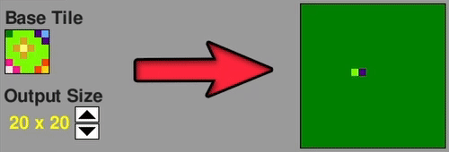

# Paint A Wave Function Collapse

This application is a basic implementation of the procedural image generation of the [Wave Function Collapse Algorithm](https://github.com/mxgmn/WaveFunctionCollapse/), made in Python's Pygame library. It allows the user to paint a sample, a so-called 'Base Tile', and then procedurally generate a new, larger image based on the patterns extracted from the sample Base Tile. The application is also multi-threaded, which means that the UI will remain responsive and the state of the generated image will gradually update as the WFC algorithm is executing.

Even though the application is written in Python, it has been compiled to WebAssembly and **is entirely accessible from within the browser, no Python installation reqiured!** (JavaScript needs to be enabled)

### **[Access the project here, hosted on GitHub Pages!](https://vik-ma.github.io/paint-a-wave-function-collapse/)**

## Instructions
There are already five premade sample base tiles that you can generate a new image from. Select a Base Tile in the bottom right corner by clicking on them, and then click the **'Start WFC'** button to start the Wave Function Collapse algorithm and watch the procedural generation unfold over the next seconds.

Click on the **'Paint New Tile'** button to enter Paint Mode, where you can paint your own Base Tiles. Keep in mind that not all Base Tiles will be able to successfully collapse. Since backtracking is not currently implemented in this app, the WFC algorithm will fail when it has generated a 2x2 pattern that does not intersect with any pattern in the list of patterns extracted from the Base Tile. The WFC algorithm can also take a very long time generating an image if the Base Tile contains too many 2x2 patterns. A warning will appear if a Base Tile may contain too many patterns.

The application also provides some more information, including a Help section, but also little boxes that provide additional information, which appears when you hover the mouse over certain elements in the application's GUI.

## Things To Note
- Currently, the implemented Wave Function Collapse algorithm uses only the 'Adjacent Model' contraints, which means that the only rule for which pattern can be propagated is whether or not it can intersect with an already propagated 2x2 pattern. This can result in generated images that does not really resemble their Base Tile. Check out the [Wave Function Collapse Algorithm GitHub Page](https://github.com/mxgmn/WaveFunctionCollapse/#readme) for examples of more complex constraints and what they would look like.

- Since backtracking is also not implemented in this app, the WFC algorithm will fail and stop when it encounters a pattern that can not intersect with any pattern extracted from the Base Tile. Backtracking would prevent the WFC from stopping when such an encounter occurs, but it still won't guarantee that the wave function will fully collapse.

- The web version of this app runs about 2-3 slower than it runs on desktop, and the GUI will get particularly slow during WFC execution. If the 'Cancel WFC' button does not work during this time, try spam clicking it.

- For some reason, assumedly related to WebAssembly, the random number generation of the web version of this app is actually predetermined. This means that the same Base Tile will always produce the same output image every time the app is launched, which is not technically prodecural generation. The random number generation in the desktop version, however, works fine and is fully procedurally generated.

- The execution time of the WFC increases exponentially with an increase in the output size of the generated image. A higher number of patterns extracted from the Base Tile also causes slower execution times. A warning will appear when the amount of patterns from the Base Tile may be too slow.

## Credits
[Original Wave Function Collapse Algorithm](https://github.com/mxgmn/WaveFunctionCollapse/)  
Basic WFC implementation in Python [guide](https://medium.com/swlh/wave-function-collapse-tutorial-with-a-basic-exmaple-implementation-in-python-152d83d5cdb1)  
Pygame application in browser via [Pygbag/Pygame WebAssembly](https://github.com/pygame-web)  
